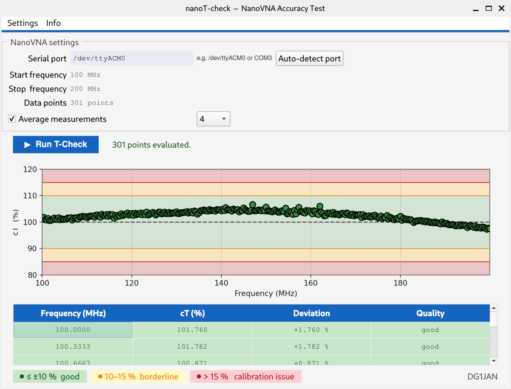
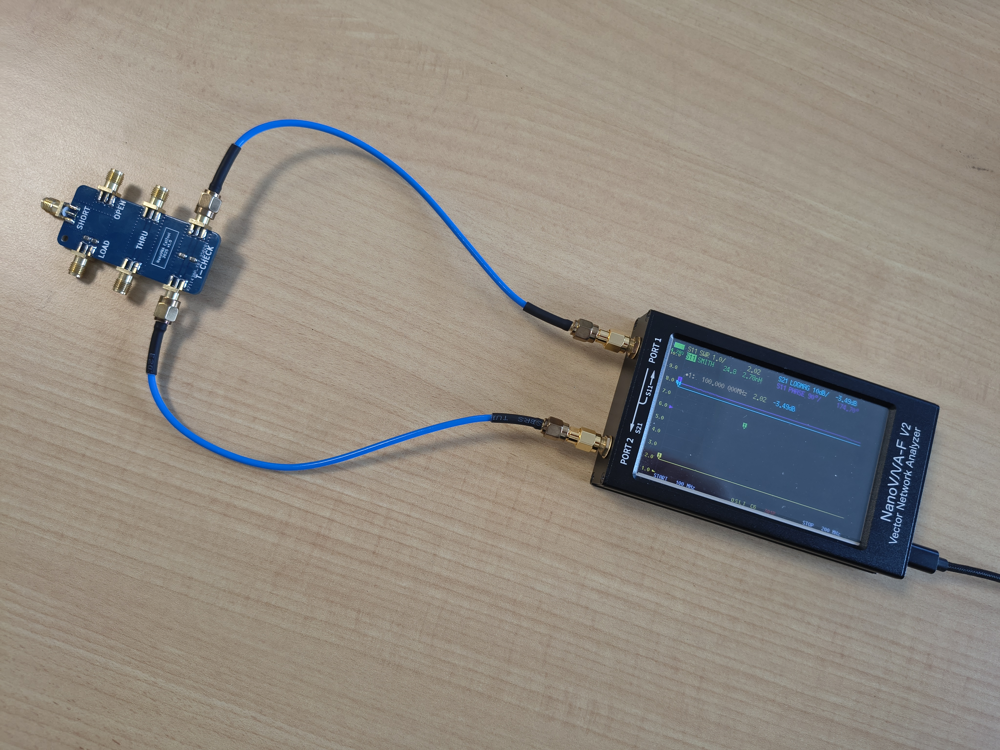

# nanoT-check
NanoVNA Accuracy Tester using the T-Check Method

***!!! This Project is heavily Vibe Coded using GitHub Copilot with Claude Sonnet 4.6 !!!***

The nanoT-check Tool can be used to perform a accuracy test of a calibrated (SOLT) NanoVNA according the Method described by Rhode & Schwarz in their Application Note 1EZ43_0E : "T-Check Accuracy Test for Vector Network Analyzers utilizing a Tee-junction"
(see  https://www.rohde-schwarz.com/us/applications/t-check-accuracy-test-for-vector-network-analyzers-utilizing-a-tee-junction_56280-15519.html )

Tested only under Debian 13 with NanoVNA-F v2 and NanoVNA H2

Feedback and tests with other NanoVNA models and under other Platform are highly welcome.  
***This Tool comes with absolutely no guarantee!!***

## Setup
Install python modules:
- matplotlib
- pyserial
- pqt5

here you can find a Linux binary (packed with Pyinstaller) to run standalone: 
https://drive.google.com/file/d/1QBF0nJBF1aOZa7WCuNiOfnFE-GSKSI1P/view?usp=sharing

## Run
Performe SOLT Calibration (for a selected frequency range) on your NanoVNA
- Connect your NanoVNA to the PC via USB
- Start tcheck_qt.py (e.g. #python3 tcheck_qt.py) / or run linux binary (./naoT-check)
- Enter Serial Port or (better) run auto detection by clicking
- connect a T-Junction with a 50 Ohm Calibration resistor to PORT1 and PORT2 of your NanoVNA
- Run the T-Check

The selected frequency and the given number of data points is read out from the NanoVNA.
By selecting 'Average measurements' the sweep will be repeated (according the selected drop down field) and an average cT Value is calculated.
The datasource can be changed to a build-in example set, for testing/debugging reasons (will be later removed)
Standard language is English, but can also be changed to German
With the option "S output on console" the script will output Frequency, S11, S21 and calculated cT on the console (stdout) on every measurement for debug reason.

Example of a connected Tee-Junction with 50Ohm (two 100 Ohm Resistors in parallel on the PCB):

